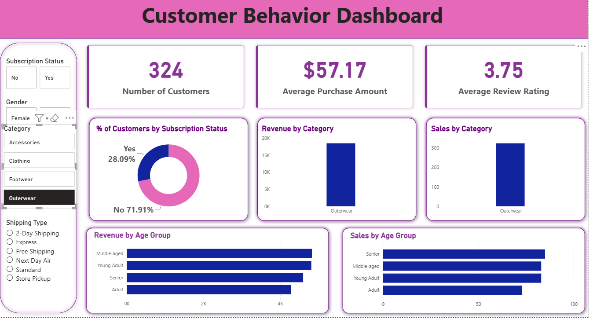

# 🛍️ Customer Shopping Behavior Analysis

<p align="center">
  
  
  
  
  
</p>

---

## 📑 Table of Contents

- [📌 Project Overview](#-project-overview)
- [🎯 Objectives](#-objectives)
- [🛠️ Tech Stack](#️-tech-stack)
- [📂 Dataset Information](#-dataset-information)
- [📋 Data Preprocessing](#-data-preprocessing)
- [🗄️ Database Integration](#️-database-integration)
- [📊 SQL Analysis](#-sql-analysis)
- [📈 Power BI Dashboard](#-power-bi-dashboard)
- [🔍 Key Insights](#-key-insights)
- [💡 Business Recommendations](#-business-recommendations)
- [📁 Project Structure](#-project-structure)
- [🚀 Skills Demonstrated](#-skills-demonstrated)
- [📌 Future Improvements](#-future-improvements)
- [📷 Dashboard Preview](#-dashboard-preview)
- [👨‍💻 Author](#-author)
- [⭐ Support](#-support)

---

# 📌 Project Overview

This project analyzes **Customer Shopping Behavior** using **Excel, Python, SQL, and Power BI** to uncover valuable business insights from **3,900 customer purchase records**.

The project follows a complete Data Analytics workflow:

- Data Collection
- Data Cleaning
- Feature Engineering
- SQL Analysis
- Data Visualization
- Business Insights
- Dashboard Development

The final dashboard helps businesses understand customer purchasing patterns and improve marketing and sales strategies.

---

# 🎯 Objectives

- Clean and preprocess raw customer shopping data.
- Analyze customer purchasing trends.
- Store processed data in SQL.
- Answer business questions using SQL queries.
- Build an interactive Power BI dashboard.
- Generate actionable business recommendations.

---

# 🛠️ Tech Stack

| Technology | Purpose |
|------------|----------|
| Python | Data Cleaning & Processing |
| Pandas | Data Manipulation |
| NumPy | Numerical Analysis |
| SQL (PostgreSQL/MySQL) | Business Queries |
| Power BI | Dashboard Creation |
| Excel | Initial Data Exploration |
| VS Code | Development Environment |

---

# 📂 Dataset Information

### Dataset Summary

| Feature | Value |
|----------|-------|
| Records | 3,900 |
| Columns | 18 |
| Missing Values | 37 |
| Missing Column | Review Rating |

### Dataset Features

- Customer ID
- Age
- Gender
- Item Purchased
- Category
- Purchase Amount
- Location
- Size
- Color
- Season
- Review Rating
- Subscription Status
- Shipping Type
- Discount Applied
- Promo Code Used
- Previous Purchases
- Payment Method
- Frequency of Purchases

---

# 📋 Data Preprocessing

The following preprocessing steps were performed using **Python (Pandas)**:

✅ Imported dataset

✅ Dataset exploration

✅ Data type validation

✅ Missing value detection

✅ Median imputation for Review Rating

✅ Feature Engineering

- Age Groups
- Purchase Frequency Categories

✅ Exported cleaned dataset

✅ Connected cleaned dataset to SQL Database

---

# 🗄️ Database Integration

The cleaned dataset was imported into SQL for advanced business analysis.

Operations performed:

- Table Creation
- Data Import
- Query Optimization
- Aggregation
- Window Functions
- Business KPI Analysis

---

# 📊 SQL Analysis

Business questions answered:

- Revenue by Gender
- Average Purchase Amount
- Category-wise Sales
- Top Rated Products
- High Spending Customers
- Discount Usage Analysis
- Subscription Analysis
- Shipping Preference Analysis
- Customer Segmentation
- Purchase Frequency Analysis

---

# 📈 Power BI Dashboard

Dashboard includes:

- KPI Cards
- Revenue Analysis
- Gender Analysis
- Category Analysis
- Product Ratings
- Subscription Insights
- Shipping Analysis
- Customer Segmentation
- Interactive Filters
- Business Recommendations

---

# 🔍 Key Insights

## 👩 Revenue by Gender

- Female customers generated slightly higher revenue than male customers.

---

## 💰 High-Value Discount Customers

Customers spending above average also utilized discount offers, indicating a strong opportunity for targeted premium promotions.

---

## ⭐ Top Rated Products

| Product | Rating |
|----------|--------|
| Blouse | ⭐⭐⭐⭐⭐ |
| Dress | ⭐⭐⭐⭐⭐ |
| Shirt | ⭐⭐⭐⭐ |

---

## 🚚 Shipping Preferences

- Express Shipping customers spent approximately **12% more** than Standard Shipping customers.

---

## 💳 Subscription Impact

- Higher average spending among subscribers.
- Significant contribution to total revenue.
- Better repeat purchase frequency.

---

## 👥 Customer Segmentation

| Segment | Percentage |
|----------|------------|
| New Customers | 50% |
| Returning Customers | 35% |
| Loyal Customers | 15% |

---

# 💡 Business Recommendations

- Increase subscription adoption through exclusive benefits.
- Introduce customer loyalty rewards.
- Promote highly rated products.
- Launch personalized marketing campaigns.
- Encourage premium shipping upgrades.
- Retain returning customers with targeted offers.

---

# 📁 Project Structure

```
Customer-Shopping-Behavior-Analysis/
│
├── Dataset/
│   └── customer_shopping_behavior.csv
│
├── Python/
│   └── Customer_Shopping_Behavior_Analysis.py
│
├── SQL/
│   └── SQL_Queries.sql
│
├── Dashboard/
│   └── Customer_Shopping_Behavior.pbix
│
├── Presentation/
│   └── Customer-Shopping-Behavior-Analysis.pptx
│
├── Images/
│   ├── Dashboard.png
│   └── SQL_Output.png
│
├── README.md
│
└── LICENSE
```

---

# 🚀 Skills Demonstrated

- Data Cleaning
- Exploratory Data Analysis (EDA)
- Feature Engineering
- SQL Query Writing
- Data Visualization
- Dashboard Design
- Business Intelligence
- Data Storytelling
- Data Analytics Workflow

---

# 📌 Future Improvements

- Customer Lifetime Value Prediction
- Sales Forecasting
- Customer Churn Prediction
- Recommendation System
- Interactive Web Dashboard
- Machine Learning Models

---

# 📷 Dashboard Preview

```markdown

```

---

# 👨‍💻 Author

## **Yash Maurya**

**Aspiring Data Analyst**

### Skills

- SQL
- Python
- Power BI
- Excel
- Tableau
- Data Visualization
- Data Analysis

### Connect with Me

- 🔗 LinkedIn: https://linkedin.com/in/yashmauryaa/
- 💻 GitHub: https://github.com/yashmaurya1/

---

# ⭐ Support

If you found this project helpful:

⭐ Star this repository

💬 Feel free to provide feedback or suggestions.

---

<p align="center">
Made with  by <b>Yash Maurya</b>
</p>